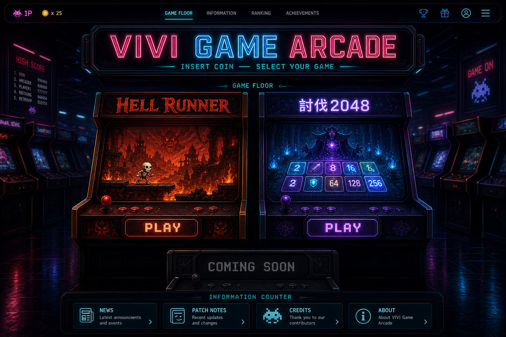

# VIVI GAME ARCADE — ダークネオンアーケード仕様書

更新日: 2026-08-16

## 1. 目的

現在の「ゲーム置き場」を、作品一覧ではなく「夜のゲームセンターへ入って筐体を選ぶ体験」に刷新する。
HELL RUNNER、討伐2048、今後追加するゲームを同じ世界観で包みつつ、各作品の個性は筐体の色・キービジュアル・演出で分ける。

### 成功条件

- 最初の3秒で「高品質なゲームセンター」「遊べるゲームが並んでいる」と伝わる
- スマホでは1ゲームずつ大きく、PCでは複数筐体を見比べられる
- PLAYまでの操作を邪魔せず、更新履歴とクレジットも見つけられる
- ゲームが3本、5本、10本へ増えても同じ形式で追加できる
- 画像が読み込めない場合でもタイトルとPLAYボタンは利用できる

## 2. デザインコンセプト

### キーワード

ダーク / ネオン / 深夜のアーケード / ピクセルアート / 金属筐体 / 床の反射 / 薄い煙 / 高級感

### 表現の方向

- 背景は黒ではなく、青紫を含んだ暗いゲームセンター
- シアンとマゼンタをサイト共通色、ゲーム固有色をアクセントに使う
- レトロゲームセンターの形を残しつつ、安っぽい「レトロ風サイト」にはしない
- ピクセル要素は見出し・小ラベル・ランプに限定し、本文は読みやすい現代的な書体にする
- 光彩は重要要素の周囲だけ。すべてを光らせず、暗部を十分残す

### 基本色

| 用途 | 色 |
|---|---|
| 最暗部 | `#05040A` |
| 背景青黒 | `#090D1A` |
| パネル | `#111425` |
| 共通シアン | `#20E6FF` |
| 共通マゼンタ | `#FF2BA6` |
| 通常文字 | `#F2F5FF` |
| 補助文字 | `#98A2BD` |
| HELL RUNNER | `#FF3B24` / `#FF9A2E` |
| 討伐2048 | `#714BFF` / `#28D7FF` |
| COMING SOON | `#6A7087` |

## 3. 情報設計

### 3.1 ARCADE ENTRANCE

- サイトロゴ `VIVI GAME ARCADE`
- キャッチコピー `INSERT COIN — SELECT YOUR GAME`
- 稼働中ゲーム数
- 最新更新日
- 背景には奥へ続く筐体列。文字を置く中央上部は暗く空ける

### 3.2 GAME FLOOR

ゲームを筐体型カードとして表示する。

各筐体に必要な情報:

- キービジュアル
- ゲームタイトル
- ジャンル
- 40〜70文字の紹介
- `稼働中` / `開発中` / `COMING SOON`
- ランキング、スマホ対応、音あり等の小ラベル
- PLAYボタン

HELL RUNNERは赤橙の地獄ネオン、討伐2048は青紫の魔法ネオンとする。

### 3.3 NEXT CABINET

- 3本目以降の予告枠
- 完成前は暗幕・ノイズ・`COMING SOON`表示
- テトリスは公開可能になるまでゲーム名を確定表示しない

### 3.4 INFORMATION COUNTER

ゲーム選択より視覚的に弱くする。

- NEWS
- PATCH NOTES
- CREDITS
- ABOUT

各項目はモーダルまたは画面内ドロワーで開く。長文をトップ画面へ常時展開しない。

### 3.5 FOOTER

- 制作者表記
- GitHubへのリンク
- 素材クレジット入口
- サイトバージョン

## 4. レスポンシブ仕様

### PC: 900px以上

- コンテンツ最大幅: 1280px
- 左右余白: 最低32px
- ヒーロー高さ: 520〜680px
- ゲーム筐体: 2〜3列、カード幅360〜520px
- 主役2本は同じ大きさで横並び
- 背景は画面幅いっぱい、主要情報は中央1280px以内

### タブレット: 600〜899px

- 筐体は2列または横スクロール
- ヒーロー高さ: 460〜560px
- 情報パネルは2列

### スマホ: 599px以下

- 基準幅: 390px
- 横余白: 16px
- ヒーロー高さ: 430〜520px
- 筐体は1列、カード幅は画面幅から32pxを引いた値
- PLAYボタンのタップ領域は高さ56px以上
- キービジュアル比率は16:9を維持
- 装飾よりゲーム名とPLAYを優先し、横スクロールを発生させない

## 5. 必要画像・素材一覧

画像生成AIで作る素材には原則として文字を入れない。タイトル、PLAY、状態表示はHTMLで重ねる。

### A. アーケード背景

| 項目 | 仕様 |
|---|---|
| ファイル名 | `images/portal/arcade-bg-desktop.webp` |
| 制作サイズ | 2560×1440px |
| 表示用途 | PCのヒーロー背景とページ全体の雰囲気 |
| 構図 | 正面〜わずかな広角。左右に筐体列、中央に奥行きと暗い空間 |
| セーフエリア | 中央50%、上部35%には人物・ロゴ・強い光を置かない |
| 必須要素 | 暗い金属筐体、シアン/マゼンタ光、濡れたような床反射、薄い煙 |
| 禁止 | 読める文字、企業ロゴ、実在ゲーム、人物、明るすぎる白照明 |

スマホ用は単純な切り抜きにせず、別構図で制作する。

| 項目 | 仕様 |
|---|---|
| ファイル名 | `images/portal/arcade-bg-mobile.webp` |
| 制作サイズ | 1080×1920px |
| 構図 | 中央に奥へ続く通路、左右端に筐体。中央上部はロゴ用に暗く空ける |

### B. サイトロゴ

| 項目 | 仕様 |
|---|---|
| ファイル名 | `images/portal/vivi-game-arcade-logo.png` |
| 制作サイズ | 1600×600px、透過PNG |
| 表示目安 | PC 520×195px、スマホ 330×124px |
| 文言 | `VIVI GAME ARCADE` |
| デザイン | 金属製アーケード看板。シアン外周、マゼンタの補助光、内部は白〜薄青 |
| ルール | 小さくしても輪郭が残る。極端に細い線を使わない |

ロゴは画像生成案を下絵として使い、最終文字は正確性と透過を別々に検査する。誤字があるもの、
または透明に見える市松模様を画像へ焼き込んだものは不採用とし、HTML文字または別制作で置き換える。

#### ロゴ透過の必須指示

画像生成時は、次の条件をプロンプトへ明記する。

- 看板の外側を**実際のアルファチャンネルで完全透明**にする
- 市松模様、白、灰色、黒などの背景を描かない
- 透明を表すプレビュー模様を画像内容へ含めない
- 看板外周に白・灰色のマットや四角い半透明面を残さない
- 看板本体、文字、看板から自然に漏れる発光だけを残す
- 文言は `VIVI GAME ARCADE` の1種類のみ。文字を追加・省略・重複しない

#### 納品前の透過検査

見た目だけで透明と判断しない。保存後に画像ファイルを検査し、次をすべて満たした場合だけ採用する。

1. PNGが `RGBA` または同等のアルファチャンネル付き形式である
2. 画像四隅のアルファ値がすべて0である
3. 看板外側に十分な数のアルファ0ピクセルが存在する
4. 暗色と明色の両方の背景へ重ね、四角い背景・市松模様・白縁が見えない
5. `VIVI GAME ARCADE` の綴りが完全に正しい
6. 330px幅へ縮小しても文字と看板外形を判別できる

アルファチャンネルが存在しない時点で不採用とする。透過生成を繰り返しても検査を通らない場合は、
不完全な画像を無理に使わず、現在のHTML文字ロゴを正式なフォールバックとして維持する。

### C. ゲーム用キービジュアル

共通制作サイズは1600×900px、16:9。文字・ロゴ・UIは入れない。

#### HELL RUNNER

- ファイル名: `images/portal/keyart-hell-runner.webp`
- 骸骨ランナーを右向きで中央より少し左
- 崩れる墓地〜地獄の足場、奥に死神
- 赤、橙、暗紫。炎は画面端と奥へ配置
- キャラクターの顔とシルエットをスマホ縮小時にも判別可能にする
- 既存ゲームと異なる服装・人間化・写実的骨格へ変更しない

#### 討伐2048

- ファイル名: `images/portal/keyart-boss-2048.webp`
- 手前に発光する数字タイル、奥に巨大ボス
- 青、紫、シアン。魔法陣とダンジョン
- 数字は画像生成で崩れやすいため、読める数字を必須要素にしない
- パズル盤面そのものはHTML側の装飾で補う

### D. 筐体フレーム

筐体の基本形はCSSで作り、質感と装飾だけを画像にする。画面サイズごとの引き伸ばし事故を防ぐため、完成筐体を一枚画像にはしない。

| 素材 | 制作サイズ | 形式 | 用途 |
|---|---:|---|---|
| `cabinet-metal-texture.webp` | 1024×1024 | WebP | 黒い金属の薄い反復テクスチャ |
| `cabinet-glow-cyan.png` | 1024×512 | 透過PNG | シアンの周辺光 |
| `cabinet-glow-red.png` | 1024×512 | 透過PNG | HELL RUNNER用周辺光 |
| `cabinet-glow-purple.png` | 1024×512 | 透過PNG | 討伐2048用周辺光 |
| `cabinet-screen-glare.png` | 1024×576 | 透過PNG | 画面ガラスの反射。ごく薄く使用 |

### E. ボタン

PLAY等の文字は画像へ焼き込まずHTMLで表示する。背景フレームだけを共通素材にする。

| 項目 | 仕様 |
|---|---|
| ファイル名 | `images/portal/button-frame.png` |
| 制作サイズ | 1200×300px、透過PNG |
| 表示比率 | 4:1 |
| デザイン | 黒い金属縁、内側にシアン、左右に小さなランプ |
| セーフエリア | 中央70%を文字用に空ける |
| 状態 | 通常色はCSS。hover/activeはCSSの発光と移動で表現 |

ゲーム固有PLAYボタンはフレーム共通、光の色だけCSS変数で変更する。

### F. 小アイコン

NEWS、PATCH、CREDITS、ABOUT、RANKING、MOBILE、SOUNDの7種。

- 元サイズ: 256×256px
- 表示サイズ: 20〜32px
- 形式: 可能ならSVG、画像生成を使う場合は透過PNG
- 同じ線幅、正面視点、シアン単色
- アイコン内に文字を入れない

単純な形はAI画像ではなくSVGまたはCSSで制作する。

### G. COMING SOON素材

- ファイル名: `images/portal/coming-soon-cabinet.webp`
- サイズ: 1600×900px
- 消灯した筐体画面、薄い走査線、中央は文字を載せるため暗く空ける
- ゲーム内容を断定するキャラクターやロゴは描かない

## 6. 画像制作共通ルール

1. AI生成画像へ重要な文字を焼き込まない。例外は、ユーザー確認済みの筐体看板タイトルと独立したPLAYボタン素材だけとし、綴りを原寸と縮小表示の両方で検査する
2. 実在企業、既存ゲーム、既存キャラクターのロゴや意匠を入れない
3. 画像の四隅へ重要な被写体を置かない
4. PC用画像をスマホで無理に切り抜かず、必要なら別構図を作る
5. 発光部分の白飛びを避け、文字を重ねられる暗部を残す
6. ノイズ、粒子、煙を増やしすぎず、ゲーム画像の判別を優先する
7. 納品時は元PNGを保存し、公開用にWebPを別出力する
8. 公開用WebPは画質80〜88を目安にし、1枚500KB前後を目標とする
9. 透過素材はロゴに限らず、生成直後のPNG原本がRGBA、四隅のアルファ0、十分な完全透明画素をすべて満たすこと。黒・白・市松模様を描いた原本は不採用とし、後処理で透明化した公開用画像を「生成時点の透過合格」と扱わない
10. 同系統の素材は色温度、金属質感、光の太さを統一する

### 透過生成素材の採用判定

1. 生成直後のPNG原本を検査し、対象外にアルファ0、描画対象に0より大きいアルファ値が存在する
2. 四隅のアルファ値がすべて0である
3. 描く対象の外側に十分なアルファ0画素が存在する
4. 暗色背景と明色背景へ重ね、市松模様・四角い面・白縁・黒縁が見えない
5. 上記を通過した原本だけを公開用WebPへ変換する。変換後もアルファと四隅を再検査する
6. 市松模様を描いた原本を色選択や切り抜きで救済したものは試作扱いとし、本番素材へ採用しない

### 筐体・PLAY素材の共通寸法

- 筐体3種の公開用キャンバスはすべて `1200×1680px`
- 透過原本を `1080×1580px` の共通外形へ正規化し、キャンバスの左60px・上50pxへ配置する
- PLAYボタン2種の公開用キャンバスはすべて `1024×256px`、実物外形は `960×240px`
- PLAYボタンは筐体側の黒い差込口と同じ角丸長方形とし、八角形・切り落とし角・外側金属枠・ボルト・側面ランプを付けない
- 筐体側の金属枠が四辺に見えるよう、ボタン本体は差込口の内側より少し小さくする
- PLAYリンクは全筐体で左30%・上62%・幅40%・縦横比4:1を共通値とする
- 生成後の透明余白切り詰めだけで公開寸法を決めない。原本の保管と、公開用の共通寸法化を別工程にする

### 重要文字の共通組版

- 筐体タイトルとPLAYは画像生成へ文字描画を任せず、`BIZ UDゴシック Bold` で正確に合成する
- 筐体タイトルは3種とも描画後の文字高76px、看板の同一中心座標へ配置する
- 長いタイトルも縦方向の文字高を変えず、横幅だけを看板内へ収める
- PLAYは2種とも描画後の文字高90px、ボタンの水平・垂直中央へ配置する
- 発光幅・字間・太さは共通とし、テーマごとに発光色だけを変更する

## 7. UI実装ルール

- ゲーム名は筐体画像の看板へ含め、綴りに失敗した場合だけ独立した看板素材へ分離する
- PLAYは筐体とは別の透過ボタン画像にし、その画像全体をリンク領域として空き枠へ割合指定で重ねる
- 画像が読めない場合にも内容が分かるよう、ゲーム名とPLAYのアクセシブルなHTMLラベルを残す
- PLAYリンクはJavaScriptなしでも遷移可能にする
- hoverだけに情報を置かず、タップ端末でも同じ内容を見られるようにする
- 動きは200〜450ms。常時点滅は入口看板とCOMING SOONの弱い演出だけ
- `prefers-reduced-motion` では煙、走査線、浮遊、パララックスを停止する
- モーダル表示中は背景スクロールを止め、ESCと閉じるボタンの両方に対応する
- キーボードフォーカスをシアンの輪郭で明示する
- 画像には代替テキストを用意する
- 音は自動再生しない。将来環境音を付ける場合も明示操作でONにする

## 8. 表示文言（仮）

- サイト名: `VIVI GAME ARCADE`
- キャッチコピー: `INSERT COIN — SELECT YOUR GAME`
- ゲーム一覧見出し: `GAME FLOOR`
- 情報見出し: `INFORMATION COUNTER`
- 稼働中: `NOW PLAYING`
- 開発中: `IN DEVELOPMENT`
- 予告: `COMING SOON`
- 起動ボタン: `PLAY`

日本語説明は残し、英語は看板・短いラベルとして使用する。

## 9. 制作順序

1. PC/スマホのワイヤーフレームをHTML/CSSで作る
2. アーケード背景PC版・スマホ版を制作
3. サイトロゴを制作
4. HELL RUNNERと討伐2048のキービジュアルを制作
5. 筐体の質感、光、画面反射を制作
6. ボタンフレームと小アイコンを制作
7. レスポンシブ表示、読み込み速度、操作性を確認
8. パッチノートとクレジットをモーダルへ移す
9. PlaywrightでPC/スマホの基準画像を作成

## 10. 完成判定

- 390px幅で横にはみ出さない
- 主要画像読み込み前でもゲーム名とPLAYが見える
- PCで2作品を同時に比較できる
- スマホで最初のゲームのPLAYまで2回以内のスクロールで到達できる
- パッチノートとクレジットをトップ画面から2操作以内で開ける
- 画像が重くて初回表示を長時間塞がない
- 実在作品の模倣ではなく、VIVI GAME ARCADE独自の見た目になっている

## 11. コンセプトモックアップ

- 保存先: `docs/mockups/dark-neon-arcade-concept.png`
- 用途: レイアウト、色、光、筐体の存在感、情報密度を共有するための目標画像
- この一枚をそのままサイト背景には使用しない
- 画像内の細かな文字・数字・アイコンは完成仕様ではない。実装時はHTML/CSSで正確に作る
- 実制作では背景、ロゴ、キービジュアル、筐体装飾、ボタンフレームへ分解する
- モックアップはPC版の方向確認用。スマホ版は本仕様の1列レイアウトに従って別途設計する
